# Motion gallery

Recorded transition/animation clips complementing the still gallery in
[`docs/screenshots`](../screenshots/README.md). Each cell plays inline
(animated WebP preview); click through for the full-quality clip.
Regenerate with `npm run videos:web` (static Storybook + Playwright),
`npm run videos:ios` (booted simulator + Metro), and
`npm run videos:index`.

## Web (Chromium)

One continuous take per story: states in order, then Escape rounds.
Blocking/veto stories deliberately end open — the refusal is the
demo.

| Overlays/Dialog — Basic | Overlays/Dialog — Non Dismissable |
| --- | --- |
|  |  |

| Overlays/Dialog — Scrollable Content | Overlays/Dialog — Styled Surface And Backdrop |
| --- | --- |
|  | [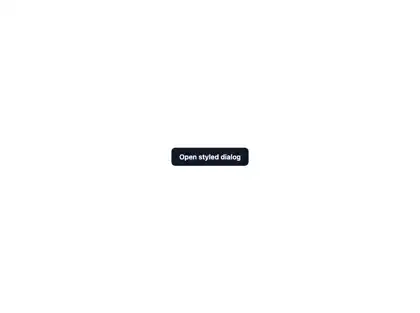](web/overlays-dialog--styled-surface-and-backdrop.webm) |

| Overlays/Dialog — Compound Parts | Overlays/Drawer — Right Side |
| --- | --- |
| [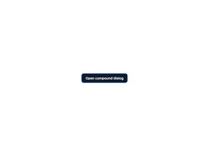](web/overlays-dialog--compound-parts.webm) |  |

| Overlays/Drawer — Left Side | Overlays/Drawer — Fixed Width Scrolling |
| --- | --- |
|  |  |

| Overlays/Drawer — Non Dismissable | Overlays/Drawer — No Backdrop |
| --- | --- |
|  | [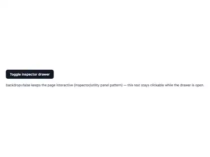](web/overlays-drawer--no-backdrop.webm) |

| Overlays/Drawer — Styled Surface | Overlays/Popover — Basic |
| --- | --- |
|  |  |

| Overlays/Popover — Opening one popover closes the other (auto displaces auto) | Overlays/Popover — Outside Press Dismisses |
| --- | --- |
| [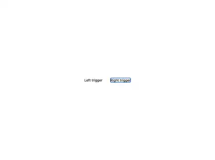](web/overlays-popover--displaces-other-popover.webm) | [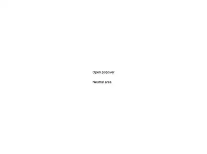](web/overlays-popover--outside-press-dismisses.webm) |

| Overlays/Popover — Placements | Overlays/Popover — Non Dismissable |
| --- | --- |
| [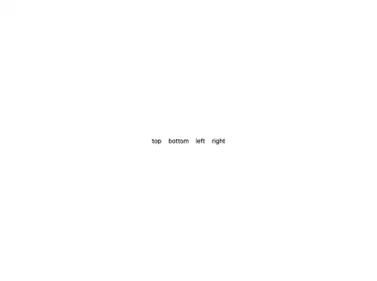](web/overlays-popover--placements.webm) | [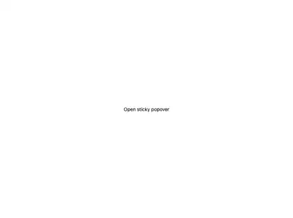](web/overlays-popover--non-dismissable.webm) |

| Overlays/Popover — closeOnScroll (default) — page scroll dismisses | Overlays/Popover — closeOnScroll exemption — scrolling inside the panel |
| --- | --- |
| [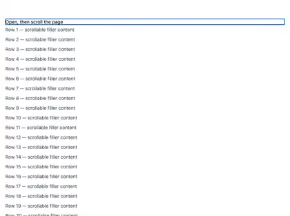](web/overlays-popover--close-on-scroll.webm) | [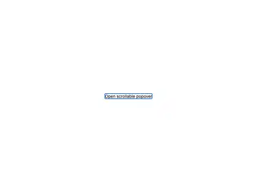](web/overlays-popover--scroll-inside-panel-does-not-dismiss.webm) |

| Overlays/Popover — Displacement force-closes dismissable=false; veto survives | Overlays/Sheet — Content Sized |
| --- | --- |
| [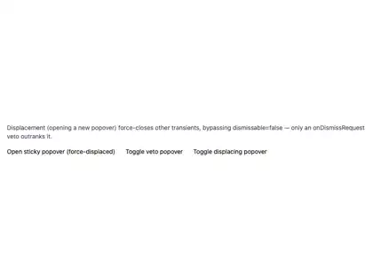](web/overlays-popover--displacement-vs-non-dismissable.webm) | [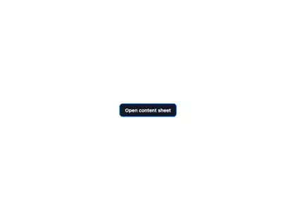](web/overlays-sheet--content-sized.webm) |

| Overlays/Sheet — Three Detents | Overlays/Sheet — Scroll inside vs drag-to-dismiss arbitration |
| --- | --- |
| [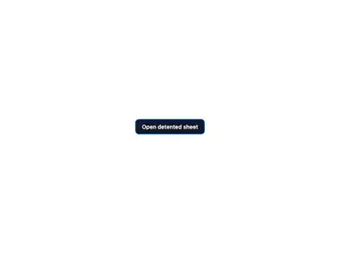](web/overlays-sheet--three-detents.webm) |  |

| Overlays/Sheet — Non Dismissable | Overlays/Sheet — No Scrim |
| --- | --- |
| [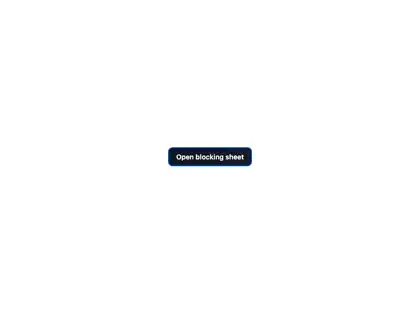](web/overlays-sheet--non-dismissable.webm) | [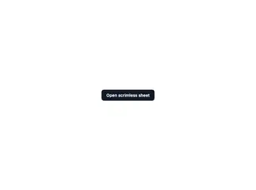](web/overlays-sheet--no-scrim.webm) |

| Overlays/Sheet — Styled And Narrow | Overlays/Stacking & Nesting — Popover Inside Dialog |
| --- | --- |
|  |  |

| Overlays/Stacking & Nesting — Press inside the dialog closes only the popover | Overlays/Stacking & Nesting — Dialog Above Drawer |
| --- | --- |
|  |  |

| Overlays/Stacking & Nesting — Tooltip Inside Sheet | Overlays/Stacking & Nesting — Kitchen sink: dialog → popover → tooltip |
| --- | --- |
|  | [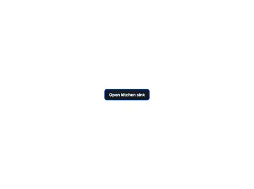](web/overlays-stacking-nesting--kitchen-sink-three-deep.webm) |

| Overlays/Tooltip — Hover And Focus | Overlays/Tooltip — Escape dismisses (WCAG 1.4.13) |
| --- | --- |
| [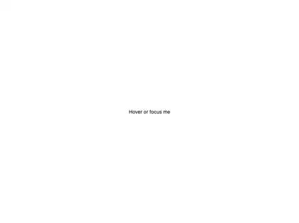](web/overlays-tooltip--hover-and-focus.webm) | [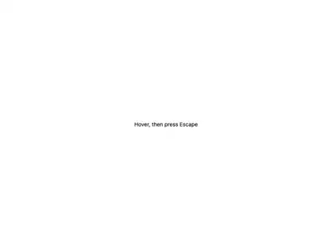](web/overlays-tooltip--escape-dismisses-hint.webm) |

| Overlays/Tooltip — Hovering a tooltip never closes an open popover | Overlays/Tooltip — Hover intent: first hover waits, warm hover is instant |
| --- | --- |
| [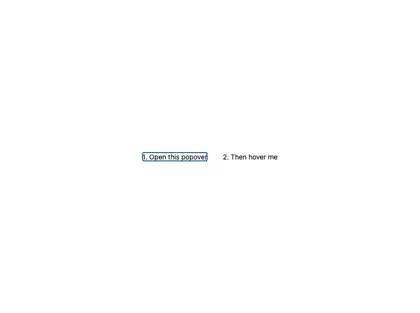](web/overlays-tooltip--hint-does-not-displace-auto.webm) | [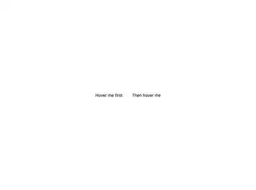](web/overlays-tooltip--delayed-then-instant.webm) |

| Overlays/Tooltip — With Boundary | Overlays/Tooltip — Render Prop Trigger |
| --- | --- |
| [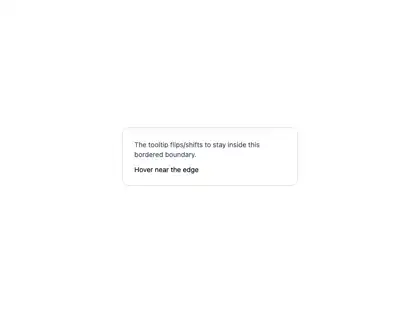](web/overlays-tooltip--with-boundary.webm) | [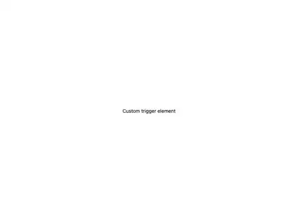](web/overlays-tooltip--render-prop-trigger.webm) |

## iOS (simulator)

Auto-pressed opens (the OS present animations) and kernel-routed
dismissals via the route channel; stacked scenarios unwind one layer
at a time. Popover/Tooltip scenarios open through plain library
Trigger parts and have no headless-drivable native clips.

| dialog basic | dialog non dismissable | dialog scrollable |
| --- | --- | --- |
| [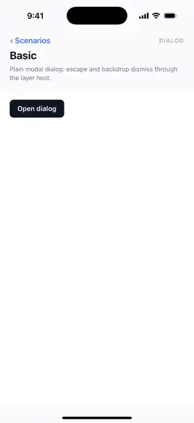](ios/dialog-basic.mp4) | [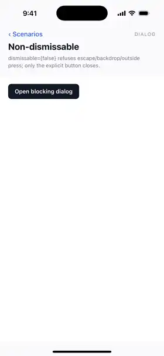](ios/dialog-non-dismissable.mp4) | [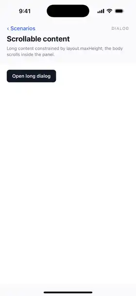](ios/dialog-scrollable.mp4) |

| dialog styled | dialog compound | sheet content sized |
| --- | --- | --- |
| [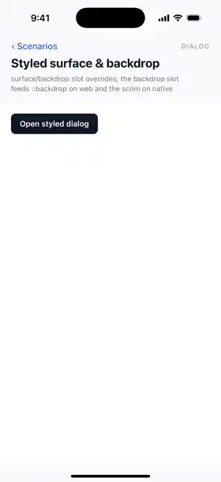](ios/dialog-styled.mp4) | [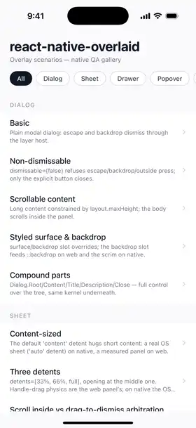](ios/dialog-compound.mp4) | [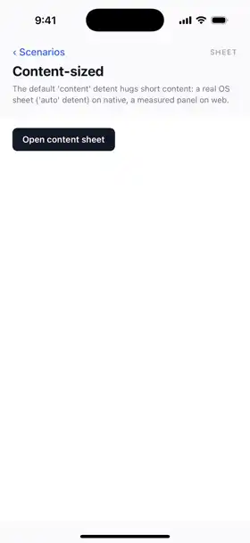](ios/sheet-content-sized.mp4) |

| sheet three detents | sheet scrolling | sheet non dismissable |
| --- | --- | --- |
| [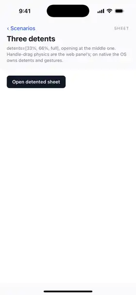](ios/sheet-three-detents.mp4) | [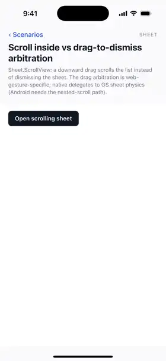](ios/sheet-scrolling.mp4) | [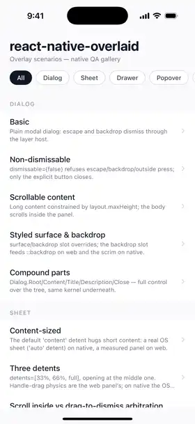](ios/sheet-non-dismissable.mp4) |

| sheet no scrim | sheet styled | drawer right |
| --- | --- | --- |
| [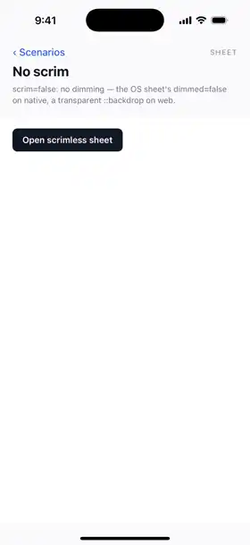](ios/sheet-no-scrim.mp4) | [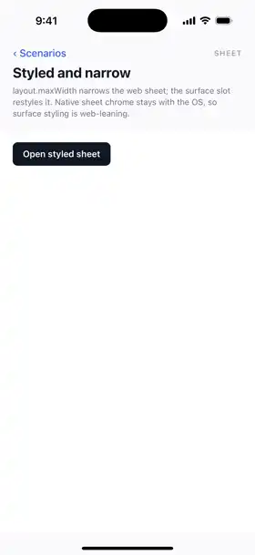](ios/sheet-styled.mp4) |  |

| drawer left | drawer fixed width | drawer non dismissable |
| --- | --- | --- |
| [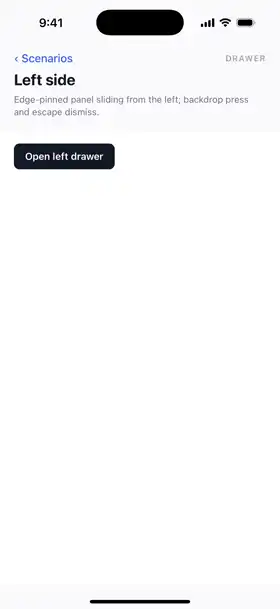](ios/drawer-left.mp4) | [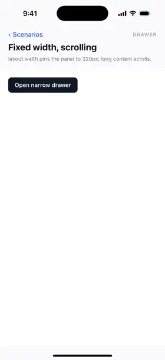](ios/drawer-fixed-width.mp4) | [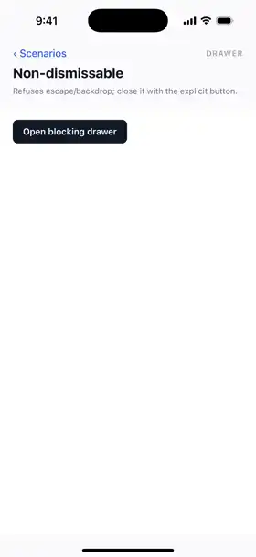](ios/drawer-non-dismissable.mp4) |

| drawer no backdrop | drawer styled | stacking popover in dialog |
| --- | --- | --- |
| [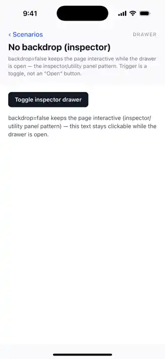](ios/drawer-no-backdrop.mp4) | [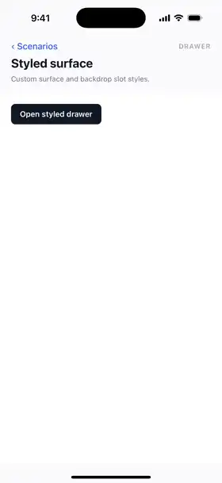](ios/drawer-styled.mp4) | [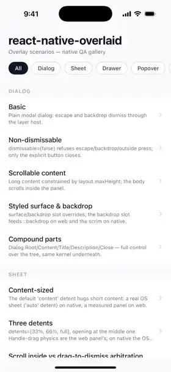](ios/stacking-popover-in-dialog.mp4) |

| stacking dialog above drawer | stacking tooltip in sheet | stacking kitchen sink |
| --- | --- | --- |
| [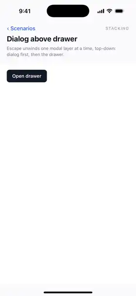](ios/stacking-dialog-above-drawer.mp4) | [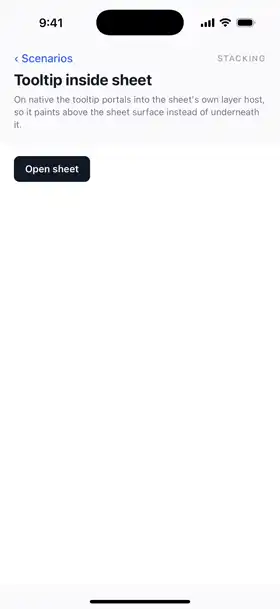](ios/stacking-tooltip-in-sheet.mp4) | [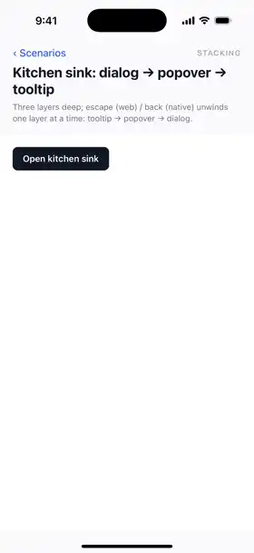](ios/stacking-kitchen-sink.mp4) |

